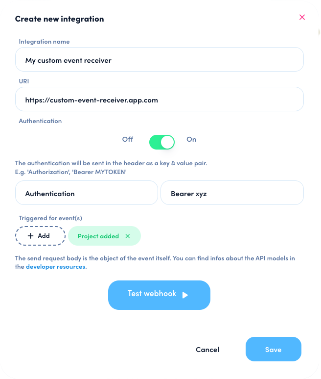

# Webhooks

Webhooks allow application developers to receive and react to changes happening in awork without constantly polling and checking.

A webhook is triggered for an entire workspace. For example on the `project-added` webhook, you receive events for all projects created in your workspace, no matter who created it or which team it belongs to. This means that user permissions and roles are not checked and have to be evaluated by the developer, if relevant.

## Configuration

To configure a webhook, go to your awork workspace, navigate to _Settings_ > _Integrations_, then open the _Integration Library_ and select _Webhooks_.

You are then asked to provide a name and the URL for the webhook. Authorization information is optional and can be added to the webhook request as a header where you can specify the header name and value.

<figure><figcaption><p>An example of a webhook configuration in awork</p></figcaption></figure>


Finally, select the events you want this webhook to trigger on. The following event types are supported:

| Event Type                |
| ------------------------- |
| `absence_added`           |
| `absence_updated`         |
| `absence_deleted`         |
| `client_added`            |
| `client_changed`          |
| `client_deleted`          |
| `project_added`           |
| `project_changed`         |
| `project_comment_added`   |
| `project_deleted`         |
| `project_member_added`    |
| `project_member_deleted`  |
| `project_status_changed`  |
| `project_task_added`      |
| `project_task_deleted`    |
| `task_assignment_added`   |
| `task_assignment_deleted` |
| `task_changed`            |
| `task_comment_added`      |
| `task_list_added`         |
| `task_list_changed`       |
| `task_list_deleted`       |
| `task_status_changed`     |
| `time_tracking_added`     |
| `time_tracking_changed`   |
| `time_tracking_deleted`   |
| `user_activation_changed` |
| `user_added`              |
| `user_deleted`            |
| `user_status_changed`     |


You can now trigger a test event to your configured URL.

For more details, please take a look at our [Help Center](https://support.awork.com/en/articles/5415462-webhooks).

## Receiving a Webhook

When the configured event occurs, awork will send an HTTP `POST` request to the configured URL. It will contain the configured authorization header and value, if set.

The request body will contain the event metadata as well as the entity that triggered the event. For the `project-added` event, this can look like in this example:

```json
{
    "timestamp": "2023-09-03T20:28:39.5966465+00:00",
    "eventType": "project_added",
    "entity": {
        "id": "8293ac0e-0aaa-468c-b3fc-480b2d7200f0",
        "hasImage": false,
        "createdOn": "2023-09-03T20:28:39.5961826Z",
        "createdBy": "7936d6b8-3345-4770-83c8-2c8c2ed12414",
        "updatedOn": "2023-09-03T20:28:40.017585Z",
        "updatedBy": "7936d6b8-3345-4770-83c8-2c8c2ed12414",
        "projectStatus": {
            "typeOrder": 2,
            "isArchived": false,
            "type": "not-started",
            "name": "Not started",
            "id": "fb7de344-aa95-4d75-ae1b-c7c01393f267"
        },
        "tags": ["design"],
        "plannedDuration": 0,
        "tasksCount": 0,
        "tasksDoneCount": 0,
        "members": [
            {
                "id": "043a32e9-1a41-48d0-9e05-e5967ea849cc",
                "userId": "7936d6b8-3345-4770-83c8-2c8c2ed12414",
                "firstName": "Carla",
                "lastName": "Creative",
                "hasImage": false,
                "projectRoleId": "021e1b6b-3ba3-47ea-a829-141ca1686e7a",
                "projectRoleName": "Project Member",
                "isResponsible": true,
                "isDeactivated": false
            }
        ],
        "trackedDuration": 0,
        "teams": [],
        "projectStatusId": "fb7de344-aa95-4d75-ae1b-c7c01393f267",
        "name": "Website Design",
        "isPrivate": false,
        "timeBudget": 0,
        "isBillableByDefault": false
    },
    "entityId": "8293ac0e-0aaa-468c-b3fc-480b2d7200f0",
    "entityType": "project",
    "entityLink": "https://superstar-design.awork.com/projects/8293ac0e-0aaa-468c-b3fc-480b2d7200f0",
    "traceId": "5a8e9540f698455b48cd092811ade4e9",
    "triggeredBy": {
        "id": "7936d6b8-3345-4770-83c8-2c8c2ed12414",
        "firstName": "Carla",
        "lastName": "Creative"
    }
}
```

<table><thead><tr><th width="221">Metadata Property</th><th>Description</th></tr></thead><tbody><tr><td><code>timestamp</code></td><td>The date and time this event was triggered.</td></tr><tr><td><code>eventType</code></td><td>The type of event that was triggered. See table of event types above.</td></tr><tr><td><code>entity</code></td><td>The entity that was responsible for triggering the event, for example the project that was added. For more information on the properties of the entity, please refer to the model documentation in the <a href="https://openapi.awork.com">API Endpoint documentation</a>.</td></tr><tr><td><code>entityId</code></td><td>The id of the entity that triggered the event.</td></tr><tr><td><code>entityType</code></td><td>The type of entity that triggered the event.</td></tr><tr><td><code>entityLink</code></td><td>The weblink to the entity that triggered the event, or the closest entity that has a weblink, where available.</td></tr><tr><td><code>traceId</code></td><td>An awork-internal id for support purposes.</td></tr><tr><td><code>triggeredBy</code></td><td>The id, first and last name of the user that triggered the event.</td></tr></tbody></table>

## Responding to a Webhook

awork expects a webhook request to return with a successful response within 30 seconds. Otherwise, the event will be marked as failed and retried for up to 10 times.

Should a configured webhook integration fail for more than 10 times without a successful response, it will be paused until a user enables it again in the Integration settings page.

